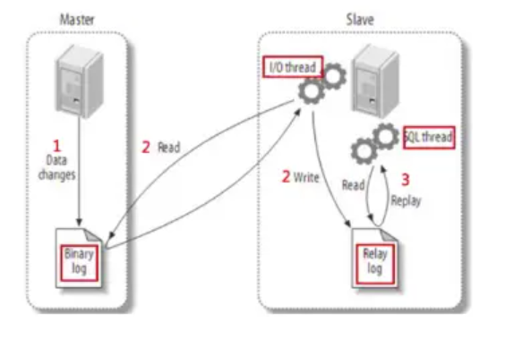

> https://segmentfault.com/a/1190000040866804

binlog记录MySQL的所有修改操作，包括DML操作(create/update/delete)以及DDL操作，必须是已提交的事务。

binlog可以在从库中进行重放，以实现MySQL数据的高可用:

- master节点将数据修改操作写入本机的binlog；
- slave节点上的I/O线程读取master节点的binlog，并写入到本地的relay-log；
- slave节点上的SQL线程读取relay-log并进行重放；



binlog格式有：statement、row、mixed；

```shell
> show variables like 'binlog_format';
+---------------+-------+
| Variable_name | Value |
+---------------+-------+
| binlog_format | ROW   |
+---------------+-------+
1 row in set (0.001 sec)
```

## statement格式

statement记录的是执行的sql语句，也就是主库上执行了什么语句，binlog中就记录什么语句。

statement格式的优点：

- 由于仅记录sql语句，日志记录量较少，可以节约磁盘和网络I/O；

statement格式的缺点：

- 对于特定的函数，比如UUID()，user()这些非确定性函数，在主备服务器上的执行结果不同，可能造成主备数据不一致；
- 生产环境中一般不使用。

## statement格式的问题

statement格式可能导致主备服务器数据的不一致，比如下表t:

```shell
mysql> CREATE TABLE `t` (
  `id` int(11) NOT NULL,
  `a` int(11) DEFAULT NULL,
  `t_modified` timestamp NOT NULL DEFAULT CURRENT_TIMESTAMP,
  PRIMARY KEY (`id`),
  KEY `a` (`a`),
  KEY `t_modified`(`t_modified`)
) ENGINE=InnoDB;
insert into t values(1,1,'2018-11-13');
insert into t values(2,2,'2018-11-12');
insert into t values(3,3,'2018-11-11');
insert into t values(4,4,'2018-11-10');
insert into t values(5,5,'2018-11-09');
```

当执行sql语句：

```shell
mysql> delete from t where a>=4 and t_modified<='2018-11-10' limit 1;
```

设置binlog_format=statement，如果主库和从库上在执行上述sql语句时，选择了不同的索引，则会删除不同的数据：

- 在主库上：如果delete操作使用索引a，那么将删除a=4这一行；
- 在从库上：如果delete操作使用索引t_modified，那么将删除t_modified='2018-11-09'，也就是a=5这一行；

## row格式

row记录的是每一行记录的增/删/改操作，若一条sql语句修改了1000条记录，row格式的日志将会分别记录1000条记录的修改，而statement仅记录一条sql语句。

row格式的优点：

- 主从复制安全，可以保证主备服务器数据完全一致；
- 若误操作修改了数据，同时没有备份恢复，可以通过分析二进制日志，通过对记录做反向操作，达到恢复数据的目的；

## mixed格式

mixed格式下，根据sql语句特点，由系统决定某个修改使用row还是statement格式进行存储。

若sql语句可能引起主备不一致，那么使用row格式，否则使用statement格式。