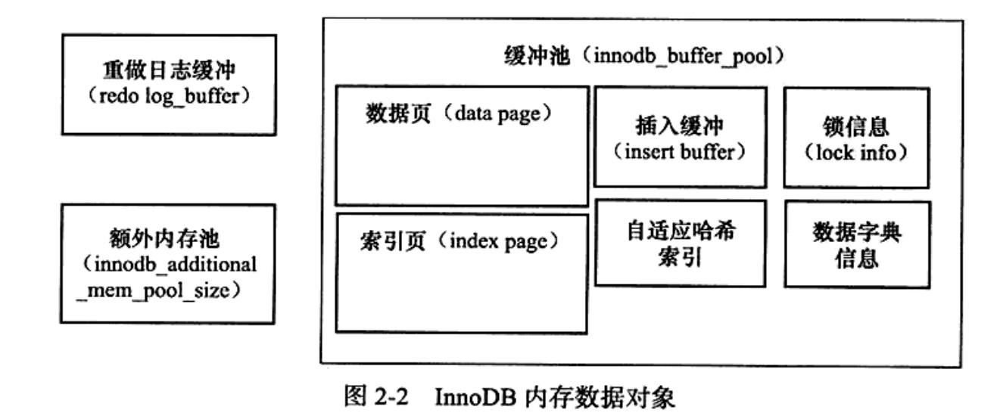
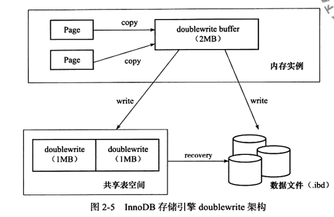

- 启动查看配置文件目录

  ```shell
  mysql --help | grep my.cnf
  # output
   order of preference, my.cnf, $MYSQL_TCP_PORT,
  /etc/my.cnf /etc/mysql/my.cnf /usr/etc/my.cnf ~/.my.cnf
  ```

- 查看数据目录

  ```mysql
  show variables like 'datadir'
  ```

- show ENGINES

- 测试数据：https://dev.mysql.com/doc/index-other.html

- show variables like 'innodb_read_io_threads'

- show variables like 'innodb_write_io_threads'

- purge thread（show variables like 'innodb_purge_threads'）：回收undo页，innodb_purge_batch_size每次回收undo页的个数

- buffer pool（show variables like 'innodb_buffer_pool_size'）：

  - 配置实例个数：show variables like 'innodb_buffer_pool_instances'，每个页根据hash值分配到不同的缓存实例中，减小内存竞争
    - select POOL_ID, POOL_SIZE,FREE_BUFFERS, DATABASE_PAGES FROM information_schema.INNODB_BUFFER_POOL_STATS

- checkpoint：将buffer pool中的脏页刷新回磁盘

- 内存数据

  

- LRU：show variables like 'innodb_old_blocks_pct'（默认：37（百分比），大约5/8之后部分）

- buffer pool状态：

  ```mysql
  show engine innodb status
  -- （不是当前状态，Per second averages calculated from the last 2 seconds）
  -- buffer pool size: 缓冲池页的个数，乘以16K，就是缓冲池的总大小
  -- free buffers:free列表页的个数
  -- database pages：LRU列表页的数量
  -- buffer pool hit rate：缓冲池命中率，一般不低于95%
  
  -- 相同效果：
  SELECT POOL_ID,HIT_RATE,PAGES_MADE_YOUNG,PAGES_NOT_MADE_YOUNG FROM information_schema.INNODB_BUFFER_POOL_STATS
  
  -- 查看缓冲池LRU列表某个SPACE的页类型
  SELECT TABLE_NAME,SPACE,PAGE_NUMBER,PAGE_TYPE FROM information_schema.INNODB_BUFFER_PAGE_LRU WHERE SPACE=4294967294
  ```

- flush list：脏页（Modified db pages）既存在于LRU列表，也存在于flush list。LRU用于管理页的可用性，flush list管理将脏页刷新回磁盘。

- innodb_log_buffer_size：show variables like 'innodb_log_buffer_size'，单位字节，不需要设置得很大，因为每一秒都会将buffer中的日志刷新回磁盘。

- Checkpoint：将缓冲池中的脏页刷新回磁盘。DML，修改或删除操作先发生在缓冲池中，后续将这些脏页刷新回磁盘。通过write ahead log策略，当事务提交时，先写redo log，再修改页，防止发生宕机引起数据丢失问题。

  - 解决的问题
    - 缩短数据库的恢复时间（循环写redo log，将已经提交，且脏页已经同步回磁盘的日志部分进行回收，防止redo log文件无限扩张，缩短数据库宕机恢复时间，因为只需要从redo log文件中恢复checkpoint之后的数据）
    - 缓冲池不够用时，将脏页刷新回磁盘（根据LRU淘汰页，如果是脏页，就强制执行checkpoint，将脏页刷新回磁盘）
    - 重做日志不可用时，刷新脏页回磁盘（redo log文件不够写，需要将脏页同步回磁盘，回收日志文件空间）
  - LSN（log sequence number）：页、redo log、checkpoint都有LSN。
  - fuzzy checkpoint发生时机
    - master thread checkpoint
    - flush_lru_list checkpoint：innodb_lru_scan_depth，控制LRU列表可用页的数量
    - async/sync flush checkpoint：redo log文件不够用，强制刷新脏页回磁盘，回收对应的日志文件空间。
    - dirty page too much checkpoint：innodb_max_dirty_pages_pct，控制脏页比例，超过则执行checkpoint。
  - master thread:
    - show variables like 'innodb_io_capacity'（默认值：200）：
      - merge insert buffer页数量为此值5%
      - 刷新脏页数量为此值
    - 执行full purge时，每次回收的undo页数量：innodb_purge_batch_size（默认300）
  
- change buffer（insert\delete\update）：适用于非唯一的二级辅助索引，非聚集索引是离散存储的，进行插入时需要离散的访问非聚集索引数据页；和buffer pool中的数据一样，也具有磁盘数据。先判断数据是否在buffer pool中，如果不在，就先存入change buffer中，后续再将多个插入合并到一个操作中。

  - show engine innodb status

    ```
    Ibuf: size 1, free list len 0, seg size 2, 0 merges
    merged operations:
     insert 0, delete mark 0, delete 0
    discarded operations:
     insert 0, delete mark 0, delete 0
     # seg size代表数据页个数。insert代表insert buffer，delete mark代表 delete buffer，delete代表purge buffer，discarded operations代表change buffer发生merge时，表已经被删了，此时无需合并到buffer pool中。
    ```

    

  - 存在的问题：

    - 如果进行了大量的插入操作，insert buffer中的数据没有merge到buffer pool中，会导致重启时间过长
    - 暂用过多的buffer pool内存。

  - innodb_change_buffering

  - innodb_change_buffer_max_size（默认为25，占用四分之一，最大有效值50）

  - 合并change buffer到buffer pool

    - 辅助索引页被读取到buffer pool。
    - insert buffer bitmap页追踪到辅助索引页没有可用空间
    - master  thread

- double write：

  > 保证数据页的可靠性。如果buffer pool中的脏页在flush到磁盘的过程中，数据库或操作系统宕机，会导致原始磁盘上的数据不完整，此时使用redo log是无意义的，因为原始数据已经被破坏了。

  - 解决方案：通过double write保存一个buffer pool中脏页在磁盘和内存上的一个的副本。刷新脏页时，先不直接写磁盘，而是将脏页数据复制到double write buffer中，内存区域大小为2MB，再分两次顺序写入double write的磁盘共享表空间位置，通过一次调用fsync。double write写好后，再将double write buffer页中的数据写入各个表空间

​		

```mysql
show global status like 'innodb_dblwr%'
Innodb_dblwr_pages_written # 写入数据页个数
Innodb_dblwr_writes	# 实际写入次数
Innodb_dblwr_pages_written/Innodb_dblwr_writes如果远小于61:1，说明系统写入压力不大
```

- 刷新邻接页（innodb_flush_neighbors）：刷新脏页时，会判断该页所在区的其他页是否是脏页，如果是，则合并到一个IO里面刷新。同时会带来两个问题（1、不怎么脏的页刷新之后可能又会被修改成为脏页；2、固态硬盘有着较高的IOPS）

- 启动、关闭和恢复：innodb_fast_shutdown（默认值1，表示不进行full purge和merge insert buffer，但是会刷新buffer pool中的脏页）、innodb_force_recovery（默认值0，表示需要恢复时，进行全部的恢复操作，如果不能进行有效恢复，比如数据页发生了corruption，则MySQL会宕机并将错误日志写入err log）

- 错误文件：log_error（默认：/var/log/mysqld.log）

- 慢查询

  - slow_query_log（默认关闭，开启设置为1，关闭设置为0）

  - long_query_time（默认10秒）

  - slow_query_log_file（慢查询日志目录）

  - log_output（日志输出方式：table和file）

    ```mysql
    show variables like 'long_query_time'
    show variables like 'slow_query_log'
    show variables like 'slow_query_log_file'
    show variables like 'log_queries_not_using_indexes'
    show variables like 'log_output'
    show variables like 'log_slow_admin_statements'
    show variables like 'min_examined_row_limit'
    ```

- binlog

  - 记录对表的修改操作，affected rows大于0才会有记录

  - point-in-time recovery，replication，sql审计

  - 位置

    - show variables like 'datadir'，binlog.0000X，索引文件binlog.index记录了binlog的文件名

  - ```mysql
    show variables like 'max_binlog_size' # 单个binlog文件最大大小，默认1GB
    show variables like 'binlog_cache_size' # 所有未提交事务的binlog会先写入cache，超出部分写入磁盘上的临时文件，默认32KB
    show variables like 'sync_binlog'	# 写cache多少次就同步binlog cache到磁盘，默认为1
    show variables like 'binlog_format'
    show global status like 'binlog_cache%' # Binlog_cache_disk_use（磁盘使用次数）Binlog_cache_use（cache使用次数）
    show master status # 查看当前正在使用哪一个binlog file，以及当前所处的位置
    show variables like 'binlog_format' # binlog格式，row和statement
    ```

  - binlog_format

    - row：记录表行更改情况，暂用空间大，也是逻辑SQL，只是记录的更全面，此格式下可以将事务隔离级别设置为read commited以获得更大的并发性

    - statement：记录的逻辑SQL，即真实执行的update语句，例如:use `test_db`; update t set a=4 where id=1,暂用空间小，如果主服务器上有uuid,rand函数，可能会出现主从不一致，因此默认使用repeatable read isolation level

    - 实验

      ```sql
      CREATE TABLE `user` (
        `id` int NOT NULL AUTO_INCREMENT,
        `username` varchar(64) COLLATE utf8mb4_german2_ci DEFAULT NULL,
        `password` varchar(255) COLLATE utf8mb4_german2_ci DEFAULT NULL,
        PRIMARY KEY (`id`),
        UNIQUE KEY `idx_username` (`username`) USING BTREE
      ) ENGINE=InnoDB AUTO_INCREMENT=50001 DEFAULT CHARSET=utf8mb4 COLLATE=utf8mb4_german2_ci;
      # 5W行数据
      INSERT INTO `test_db`.`user`(`id`, `username`, `password`) VALUES (1, '测试用户1', '123456');
      
      select @@session.binlog_format
      # 使用row格式
      set @@session.binlog_format='ROW'
      update test_db.user set password='abc'
      
      # 使用statement格式
      set @@session.binlog_format='STATEMENT'
      update test_db.user set password='abc'
      
      # 结果：row格式的日志占用是statement的2710倍
      
      
      # statement格式binlog记录
      SET @@SESSION.GTID_NEXT= 'ANONYMOUS'/*!*/;
      # at 3042931
      #231025 15:09:01 server id 1  end_log_pos 3043028 CRC32 0x5ad7e686      Query   thread_id=10    exec_time=0     error_code=0
      SET TIMESTAMP=1698217741/*!*/;
      BEGIN
      /*!*/;
      # at 3043028
      #231025 15:09:01 server id 1  end_log_pos 3043158 CRC32 0x44022c99      Query   thread_id=10    exec_time=0     error_code=0
      SET TIMESTAMP=1698217741/*!*/;
      update test_db.user set password='abc'
      /*!*/;
      # at 3043158
      #231025 15:09:01 server id 1  end_log_pos 3043189 CRC32 0x3757082c      Xid = 564
      COMMIT/*!*/;
      
      
      # row格式binlog存入格式，$ mysqlbinlog -vv binlog.000026
      ### UPDATE `test_db`.`user`
      ### WHERE
      ###   @1=50000 /* INT meta=0 nullable=0 is_null=0 */
      ###   @2='测试用户50000' /* VARSTRING(256) meta=256 nullable=1 is_null=0 */
      ###   @3='123456' /* VARSTRING(1020) meta=1020 nullable=1 is_null=0 */
      ### SET
      ###   @1=50000 /* INT meta=0 nullable=0 is_null=0 */
      ###   @2='测试用户50000' /* VARSTRING(256) meta=256 nullable=1 is_null=0 */
      ###   @3='abc' /* VARSTRING(1020) meta=1020 nullable=1 is_null=0 */
      ```

- Innodb文件

  - 表空间文件：
    - innodb_data_file_path：共享表空间，默认ibdata1:12M:autoextend
    - innodb_file_per_table：按数据库名称单独存入每张表的数据、索引。（.ibd）
  - 重做日志文件（redo log file）
    - 重新启动数据库时利用日志来恢复到之前的状态，保证数据的完整性。
    - innodb_log_file_size：每个重做日志文件的大小
    - innodb_flush_log_at_trx_commit：默认值1表示执行commit时将redo log buffer写入磁盘（0表示不主动写入磁盘，等待master thread刷新；2表示将buffer写入到操作系统缓存中）
    - redo log先写入redo log buffer，在以一个扇区的大小（512字节）从buffer中写入磁盘，因为扇区是最小的写入单元，因此可以保证是必然成功的，所以不需要doublewrite。
    - 设置得太大，恢复得时候可能需要很长的时间；设置得太小，可能会导致一个事务多次切换重做日志文件，也会导致频繁做async checkpoint（checkpoint超过redo log的capacity），导致系统抖动。
    - redo log和binlog区别：
      - binlog无论哪一种格式，都是数据库有关的，存的所有存储引擎的变动。
      - bin log存的是逻辑日志（SQL）；而redo  log记录的是关于每个页更改的物理操作情况。
      - 写入时间：bin log在事务提交前进行提交，且只写入一次到磁盘，无论事务有多大；redo log会在事务进行中不断地写入到重做日志文件中。

- 表

  - 段

    - 数据段：叶子节点
    - 索引段：非叶子节点
    - 回滚段

  - 区：不管页大小如何调整，区的大小总是1MB，默认页大小为16KB（innodb_page_size），一个区包含64个页面，建表和插入数据先使用32个碎片页，用完以后再申请连续的一个区，即64个页。

  - 页：默认16KB

  - 行：一个页最多存放的数据行数16KB/2 - 2000，即7992行。

  - innodb undo log存放于系统表空间，即ibdata1中。

  - 行格式：

    - compact：不管是char还是varchar，Null值不占用存储空间。
    - redundant：Null值varchar不占用空间，char占用空间。
    - compressed
    - dynamic

  - 行溢出：

    - varchar最大支持65535指的是字节，而建表语句中的varchar(N)指的是字符串的长度。

    - 每一行支持的最大存储空间总和是65535，如果一行中的所有列的长度总和超过65535，也会建表失败

      ```mysql
      create table test2(
      	a varchar(22000),
      	b varchar(22000),
      	c varchar(22000)
      ) charset=latin1 engine=innodb ;
      
      --output
      create table test2(
      	a varchar(22000),
      	b varchar(22000),
      	c varchar(22000)
      ) charset=latin1 engine=innodb
      > 1118 - Row size too large. The maximum row size for the used table type, not counting BLOBs, is 65535. This includes storage overhead, check the manual. You have to change some columns to TEXT or BLOBs
      > 时间: 0.001s
      ```

    - 使用多字节的字符集，如utf-8存储中文占用3个字节，使用char类型和varchar差不多
