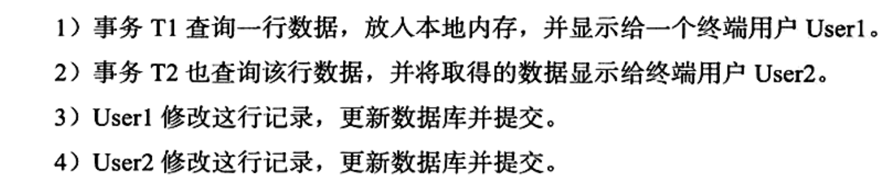

- 启动查看配置文件目录

  ```shell
  mysql --help | grep my.cnf
  # output
   order of preference, my.cnf, $MYSQL_TCP_PORT,
  /etc/my.cnf /etc/mysql/my.cnf /usr/etc/my.cnf ~/.my.cnf
  ```

- 查看数据目录

  ```mysql
  show variables like 'datadir'
  ```

- show ENGINES

- 测试数据：https://dev.mysql.com/doc/index-other.html

- show variables like 'innodb_read_io_threads'

- show variables like 'innodb_write_io_threads'

- purge thread（show variables like 'innodb_purge_threads'）：回收undo页，innodb_purge_batch_size每次回收undo页的个数

- buffer pool（show variables like 'innodb_buffer_pool_size'）：

  - 配置实例个数：show variables like 'innodb_buffer_pool_instances'，每个页根据hash值分配到不同的缓存实例中，减小内存竞争
    - select POOL_ID, POOL_SIZE,FREE_BUFFERS, DATABASE_PAGES FROM information_schema.INNODB_BUFFER_POOL_STATS

- checkpoint：将buffer pool中的脏页刷新回磁盘

- 内存数据

  

- LRU：show variables like 'innodb_old_blocks_pct'（默认：37（百分比），大约5/8之后部分）

- buffer pool状态：

  ```mysql
  show engine innodb status
  -- （不是当前状态，Per second averages calculated from the last 2 seconds）
  -- buffer pool size: 缓冲池页的个数，乘以16K，就是缓冲池的总大小
  -- free buffers:free列表页的个数
  -- database pages：LRU列表页的数量
  -- buffer pool hit rate：缓冲池命中率，一般不低于95%
  
  -- 相同效果：
  SELECT POOL_ID,HIT_RATE,PAGES_MADE_YOUNG,PAGES_NOT_MADE_YOUNG FROM information_schema.INNODB_BUFFER_POOL_STATS
  
  -- 查看缓冲池LRU列表某个SPACE的页类型
  SELECT TABLE_NAME,SPACE,PAGE_NUMBER,PAGE_TYPE FROM information_schema.INNODB_BUFFER_PAGE_LRU WHERE SPACE=4294967294
  ```

- flush list：脏页（Modified db pages）既存在于LRU列表，也存在于flush list。LRU用于管理页的可用性，flush list管理将脏页刷新回磁盘。

- innodb_log_buffer_size：show variables like 'innodb_log_buffer_size'，单位字节，不需要设置得很大，因为每一秒都会将buffer中的日志刷新回磁盘。

- Checkpoint：将缓冲池中的脏页刷新回磁盘。DML，修改或删除操作先发生在缓冲池中，后续将这些脏页刷新回磁盘。通过write ahead log策略，当事务提交时，先写redo log，再修改页，防止发生宕机引起数据丢失问题。

  - 解决的问题
    - 缩短数据库的恢复时间（循环写redo log，将已经提交，且脏页已经同步回磁盘的日志部分进行回收，防止redo log文件无限扩张，缩短数据库宕机恢复时间，因为只需要从redo log文件中恢复checkpoint之后的数据）
    - 缓冲池不够用时，将脏页刷新回磁盘（根据LRU淘汰页，如果是脏页，就强制执行checkpoint，将脏页刷新回磁盘）
    - 重做日志不可用时，刷新脏页回磁盘（redo log文件不够写，需要将脏页同步回磁盘，回收日志文件空间）
  - LSN（log sequence number）：页、redo log、checkpoint都有LSN。
  - fuzzy checkpoint发生时机
    - master thread checkpoint
    - flush_lru_list checkpoint：innodb_lru_scan_depth，控制LRU列表可用页的数量
    - async/sync flush checkpoint：redo log文件不够用，强制刷新脏页回磁盘，回收对应的日志文件空间。
    - dirty page too much checkpoint：innodb_max_dirty_pages_pct，控制脏页比例，超过则执行checkpoint。
  - master thread:
    - show variables like 'innodb_io_capacity'（默认值：200）：
      - merge insert buffer页数量为此值5%
      - 刷新脏页数量为此值
    - 执行full purge时，每次回收的undo页数量：innodb_purge_batch_size（默认300）
  
- change buffer（insert\delete\update）：适用于非唯一的二级辅助索引，非聚集索引是离散存储的，进行插入时需要离散的访问非聚集索引数据页；和buffer pool中的数据一样，也具有磁盘数据。先判断数据是否在buffer pool中，如果不在，就先存入change buffer中，后续再将多个插入合并到一个操作中。

  - show engine innodb status

    ```
    Ibuf: size 1, free list len 0, seg size 2, 0 merges
    merged operations:
     insert 0, delete mark 0, delete 0
    discarded operations:
     insert 0, delete mark 0, delete 0
     # seg size代表数据页个数。insert代表insert buffer，delete mark代表 delete buffer，delete代表purge buffer，discarded operations代表change buffer发生merge时，表已经被删了，此时无需合并到buffer pool中。
    ```

    

  - 存在的问题：

    - 如果进行了大量的插入操作，insert buffer中的数据没有merge到buffer pool中，会导致重启时间过长
    - 暂用过多的buffer pool内存。

  - innodb_change_buffering

  - innodb_change_buffer_max_size（默认为25，占用四分之一，最大有效值50）

  - 合并change buffer到buffer pool

    - 辅助索引页被读取到buffer pool。
    - insert buffer bitmap页追踪到辅助索引页没有可用空间
    - master  thread

- double write：

  > 保证数据页的可靠性。如果buffer pool中的脏页在flush到磁盘的过程中，数据库或操作系统宕机，会导致原始磁盘上的数据不完整，此时使用redo log是无意义的，因为原始数据已经被破坏了。

  - 解决方案：通过double write保存一个buffer pool中脏页在磁盘和内存上的一个的副本。刷新脏页时，先不直接写磁盘，而是将脏页数据复制到double write buffer中，内存区域大小为2MB，再分两次顺序写入double write的磁盘共享表空间位置，通过一次调用fsync。double write写好后，再将double write buffer页中的数据写入各个表空间

​		

```mysql
show global status like 'innodb_dblwr%'
Innodb_dblwr_pages_written # 写入数据页个数
Innodb_dblwr_writes	# 实际写入次数
Innodb_dblwr_pages_written/Innodb_dblwr_writes如果远小于61:1，说明系统写入压力不大
```

- 刷新邻接页（innodb_flush_neighbors）：刷新脏页时，会判断该页所在区的其他页是否是脏页，如果是，则合并到一个IO里面刷新。同时会带来两个问题（1、不怎么脏的页刷新之后可能又会被修改成为脏页；2、固态硬盘有着较高的IOPS）

- 启动、关闭和恢复：innodb_fast_shutdown（默认值1，表示不进行full purge和merge insert buffer，但是会刷新buffer pool中的脏页）、innodb_force_recovery（默认值0，表示需要恢复时，进行全部的恢复操作，如果不能进行有效恢复，比如数据页发生了corruption，则MySQL会宕机并将错误日志写入err log）

- 错误文件：log_error（默认：/var/log/mysqld.log）

- 慢查询

  - slow_query_log（默认关闭，开启设置为1，关闭设置为0）

  - long_query_time（默认10秒）

  - slow_query_log_file（慢查询日志目录）

  - log_output（日志输出方式：table和file）

    ```mysql
    show variables like 'long_query_time'
    show variables like 'slow_query_log'
    show variables like 'slow_query_log_file'
    show variables like 'log_queries_not_using_indexes'
    show variables like 'log_output'
    show variables like 'log_slow_admin_statements'
    show variables like 'min_examined_row_limit'
    ```

- binlog

  - 记录对表的修改操作，affected rows大于0才会有记录

  - point-in-time recovery，replication，sql审计

  - 位置

    - show variables like 'datadir'，binlog.0000X，索引文件binlog.index记录了binlog的文件名

  - ```mysql
    show variables like 'max_binlog_size' # 单个binlog文件最大大小，默认1GB
    show variables like 'binlog_cache_size' # 所有未提交事务的binlog会先写入cache，超出部分写入磁盘上的临时文件，默认32KB
    show variables like 'sync_binlog'	# 写cache多少次就同步binlog cache到磁盘，默认为1
    show variables like 'binlog_format'
    show global status like 'binlog_cache%' # Binlog_cache_disk_use（磁盘使用次数）Binlog_cache_use（cache使用次数）
    show master status # 查看当前正在使用哪一个binlog file，以及当前所处的位置
    show variables like 'binlog_format' # binlog格式，row和statement
    ```

  - binlog_format

    - row：记录表行更改情况，暂用空间大，也是逻辑SQL，只是记录的更全面，此格式下可以将事务隔离级别设置为read commited以获得更大的并发性

    - statement：记录的逻辑SQL，即真实执行的update语句，例如:use `test_db`; update t set a=4 where id=1,暂用空间小，如果主服务器上有uuid,rand函数，可能会出现主从不一致，因此默认使用repeatable read isolation level

    - 实验

      ```sql
      CREATE TABLE `user` (
        `id` int NOT NULL AUTO_INCREMENT,
        `username` varchar(64) COLLATE utf8mb4_german2_ci DEFAULT NULL,
        `password` varchar(255) COLLATE utf8mb4_german2_ci DEFAULT NULL,
        PRIMARY KEY (`id`),
        UNIQUE KEY `idx_username` (`username`) USING BTREE
      ) ENGINE=InnoDB AUTO_INCREMENT=50001 DEFAULT CHARSET=utf8mb4 COLLATE=utf8mb4_german2_ci;
      # 5W行数据
      INSERT INTO `test_db`.`user`(`id`, `username`, `password`) VALUES (1, '测试用户1', '123456');
      
      select @@session.binlog_format
      # 使用row格式
      set @@session.binlog_format='ROW'
      update test_db.user set password='abc'
      
      # 使用statement格式
      set @@session.binlog_format='STATEMENT'
      update test_db.user set password='abc'
      
      # 结果：row格式的日志占用是statement的2710倍
      
      
      # statement格式binlog记录
      SET @@SESSION.GTID_NEXT= 'ANONYMOUS'/*!*/;
      # at 3042931
      #231025 15:09:01 server id 1  end_log_pos 3043028 CRC32 0x5ad7e686      Query   thread_id=10    exec_time=0     error_code=0
      SET TIMESTAMP=1698217741/*!*/;
      BEGIN
      /*!*/;
      # at 3043028
      #231025 15:09:01 server id 1  end_log_pos 3043158 CRC32 0x44022c99      Query   thread_id=10    exec_time=0     error_code=0
      SET TIMESTAMP=1698217741/*!*/;
      update test_db.user set password='abc'
      /*!*/;
      # at 3043158
      #231025 15:09:01 server id 1  end_log_pos 3043189 CRC32 0x3757082c      Xid = 564
      COMMIT/*!*/;
      
      
      # row格式binlog存入格式，$ mysqlbinlog -vv binlog.000026
      ### UPDATE `test_db`.`user`
      ### WHERE
      ###   @1=50000 /* INT meta=0 nullable=0 is_null=0 */
      ###   @2='测试用户50000' /* VARSTRING(256) meta=256 nullable=1 is_null=0 */
      ###   @3='123456' /* VARSTRING(1020) meta=1020 nullable=1 is_null=0 */
      ### SET
      ###   @1=50000 /* INT meta=0 nullable=0 is_null=0 */
      ###   @2='测试用户50000' /* VARSTRING(256) meta=256 nullable=1 is_null=0 */
      ###   @3='abc' /* VARSTRING(1020) meta=1020 nullable=1 is_null=0 */
      ```

- Innodb文件

  - 表空间文件：
    - innodb_data_file_path：共享表空间，默认ibdata1:12M:autoextend
    - innodb_file_per_table：按数据库名称单独存入每张表的数据、索引。（.ibd）
  - 重做日志文件（redo log file）
    - 重新启动数据库时利用日志来恢复到之前的状态，保证数据的完整性。
    - innodb_log_file_size：每个重做日志文件的大小
    - innodb_flush_log_at_trx_commit：默认值1表示执行commit时将redo log buffer写入磁盘（0表示不主动写入磁盘，等待master thread刷新；2表示将buffer写入到操作系统缓存中）
    - redo log先写入redo log buffer，在以一个扇区的大小（512字节）从buffer中写入磁盘，因为扇区是最小的写入单元，因此可以保证是必然成功的，所以不需要doublewrite。
    - 设置得太大，恢复得时候可能需要很长的时间；设置得太小，可能会导致一个事务多次切换重做日志文件，也会导致频繁做async checkpoint（checkpoint超过redo log的capacity），导致系统抖动。
    - redo log和binlog区别：
      - binlog无论哪一种格式，都是数据库有关的，存的所有存储引擎的变动。
      - bin log存的是逻辑日志（SQL）；而redo  log记录的是关于每个页更改的物理操作情况。
      - 写入时间：bin log在事务提交前进行提交，且只写入一次到磁盘，无论事务有多大；redo log会在事务进行中不断地写入到重做日志文件中。

- 表

  - 段

    - 数据段：叶子节点
    - 索引段：非叶子节点
    - 回滚段

  - 区：不管页大小如何调整，区的大小总是1MB，默认页大小为16KB（innodb_page_size），一个区包含64个页面，建表和插入数据先使用32个碎片页，用完以后再申请连续的一个区，即64个页。

  - 页：默认16KB

  - 行：一个页最多存放的数据行数16KB/2 - 2000，即7992行。

  - innodb undo log存放于系统表空间，即ibdata1中。

  - 行格式：

    - compact：不管是char还是varchar，Null值不占用存储空间。
    - redundant：Null值varchar不占用空间，char占用空间。
    - compressed
    - dynamic

  - 行溢出：

    - varchar最大支持65535指的是字节，而建表语句中的varchar(N)指的是字符串的长度。

    - 每一行支持的最大存储空间总和是65535，如果一行中的所有列的长度总和超过65535，也会建表失败

      ```mysql
      create table test2(
      	a varchar(22000),
      	b varchar(22000),
      	c varchar(22000)
      ) charset=latin1 engine=innodb ;
      
      --output
      create table test2(
      	a varchar(22000),
      	b varchar(22000),
      	c varchar(22000)
      ) charset=latin1 engine=innodb
      > 1118 - Row size too large. The maximum row size for the used table type, not counting BLOBs, is 65535. This includes storage overhead, check the manual. You have to change some columns to TEXT or BLOBs
      > 时间: 0.001s
      ```

    - 使用多字节的字符集，如utf-8存储中文占用3个字节，使用char类型和varchar差不多
  
- 页

  - B+树不能找到记录本身，只能找到记录所在的页。

- sql_mode

- trigger：在insert/update/delete之前或之后进行调用。

- 分区：

  - 逻辑上一个表，一个索引。物理上，这个表或索引可以由多个物理分区组成。

  - 水平分区

  - 分区主要用于数据库的高可用性管理，在oltp中要小心使用。

  - 表中存在唯一索引时，分区列必须是唯一索引的一个组成部分

  - 分区类型
    - range：主要用于日期列的分区
    
      ```mysql
      drop table pt;
      create table pt(
      id int
      )
      partition by range(id)(
      partition p0 values less than (10),
      partition p1 values less than (20),
      partition p2 values less than maxvalue -- maxvalue表示无穷大
      );
      
      -- 主要用于按照日期进行分区，如果要删除某年的数据，则只需要删除对应的分区
      -- 删除分区：alter table sales drop partition p2008;
      -- 而不是执行delete语句：delete from sales where date>='2008-01-01' and date<'2009-01-01'
      ```
    
    - list
    
    - hash
    
    - key

- 索引

  - 过多的索引可能会引起iostat监控磁盘使用率处于100%

  - B+树中的B代表平衡（balance）

  - B+树索引智能找到数据行所在的页，然后数据库把页读进内存，在内存中进行查找。

  - 二叉树 -》二叉查找树 -》 平衡二叉树，平衡二叉树中任何节点的两个子树的最大高度差为1。查询速度快，但是维护代价很大。平衡二叉树多用于内存结构。
  
  - B+树的高度一般是在2—4层，即查找某一键值最多只需要2-4次磁盘IO。B+树高度平衡，叶子节点存放数据。
  
  - show index from xx_table。查看表索引信息。analyze table xx_table;（在系统非高峰期间使用）更新cardinality值，优化器会根据此值判断是否使用这个索引。
  
  - 索引添加原则：访问表中一小部分数据。对于性别，地区，类型字段，它们的取值范围很小，称为低选择度，一般不用建索引。因为低选择度的列查询出来的数据量一般比较多；如果某个字段的取值范围比较大，几乎没有重复，则属于高选择度，可以建立B+树索引。cardinality表示选择度，表示索引中不重复记录数量的预估值，cardinality/行数应该尽可能接近1，如果非常小，则需要考虑删除这个索引。
  
- online ddl：实现原理是通过执行创建和删除操作时，将insert/update/delete这类DML操作日志写入到一个缓存中，等到索引创建完毕后，再重新应用到表中，缓存的大小由innodb_online_alter_log_max_size确定，默认为128MB。

- 联合索引

  - 可以减少索引的创建

  - 联合索引的第二个键值也是进行了排序处理。

    ```mysql
    create table buy_log(
      userid int unsigned not null,
        buy_date date
    ) engine=innodb;
    alter table buy_log add key(userid);
    alter table buy_log add key(userid, buy_date);
    ```

    ```sql
    explain select * from buy_log where userid=2;
    -- 可选两个索引，实际使用了user_id索引
    ```

    

  - 使用联合索引

    

- 覆盖索引

  - 待检索的是主键列，或者待检索的是联合索引中的列，就会使用到覆盖索引。

  - 直接从辅助索引中就可以获得查询的记录，而不需要查询聚集索引，减少IO操作。

  - select count(*) from buy_log;不会查询聚集索引，而是选择辅助索引，因为辅助索引远小于聚集索引，可以减少IO次数。

    

- 执行计划里possible_keys如果是primary，就是聚集索引扫描，也就是全表扫描。

- 优化器不使用索引

  - 多发生于范围查询、join连接

  - possible_keys中显示可用索引为idx_hire_date，但是优化器最终选择了聚集索引扫描。因为该条语句查询整行信息，idx_hire_date不能覆盖整行信息，还需要使用辅助索引上的主键id回表一次。虽然idx_hire_date上的数据是有序的，但是回表的数据查找是无序的，因此会对磁盘作离散IO读；如果要访问的数据量小，优化器还是会选择辅助索引，但是如果要访问的数据量比较大（一般占据整表的20%），优化器会选择全表扫描，因为顺序读（扫全表）要远远快于离散读。如果用户使用的是固态硬盘，随机读比较快，也确信使用辅助索引更快，可以使用force index来强制使用某个索引。

    

- 索引提示（index hint）

  - 显示告诉优化器使用哪个索引。
  - 可能用到的情况
    - MySQL优化器错误的使用了某个索引，导致SQL语句运行得比较慢，这种概率非常低。
    - 某个SQL语句可以选择的索引比较多，优化器选择执行计划时间的开销大于SQL语句本身，例如range查询是比较耗时的操作。
    - 一般使用force index而不是用use index，因为use index只是告诉优化器可以选择某个索引，优化器还是会根据自己的判断选择。

- MRR优化（multi-range read）

  - 索引本身就是为了减少磁盘 IO，加快查询，而 MRR，则是把索引减少磁盘 IO 的作用，进一步放大

  - 将回表过程的随机访问变为较为顺序的访问。在辅助索引上查找到某一条满足的数据后，先不回表，放入缓存中，继续查询，（因为此时如果回表，在聚集索引上是随机非顺序读取，要读取数据可能第一条分布在数据页1上，而且1和2两个页可能物理上相距很远，第二条分布在数据页2上，第三条分布在数据页1上，但是回表数据页2时，数据页1有可能被LRU淘汰了，又得重新从磁盘读取数据页1，频繁的离散读会导致缓冲池中的页被换出）最后将满足条件的辅助索引上的主键id值进行排序。按顺序去聚集索引上取完整数据。减少缓冲池的页被替换的次数。

  - set optimizer_switch='mrr=on';如果执行计划中的extra列中出现了using mrr，则表示已生效。

  - 将某些范围查询拆分为键值对，直接过滤掉一些不符合查询条件的数据。如果没有MRR，优化器会先根据key_part1查询出大于1000且小于2000的数据，即使key_part2不等于10000。待取出完整数据后再根据key_part2进行过滤，这样会导致无用的数据被回表出来；启用MRR后，优化器会将查询条件拆分为(1000,10000),(1001,10000),(1002,10000)...,(1999,10000)，最后根据拆分的条件进行数据查询。

    ```sql
    select * from t where key_part1 >= 1000 and key_part1 < 2000 and key_part2 == 10000;
    -- 存在联合索引(key_part1, key_part2)
    ```

- 索引下推（index condition pushdown）

  - 5.6开始支持，在索引查询时就根where条件进行过滤，将过滤条件放在存储引擎层。之前是将数据取回server层再进行过滤。这样可以大大减少server层对数据的fetch。执行计划中的extra列如果有using index condition，则表示启用了索引下推优化。

    ```mysql
    select * from people where zipcode='95054' and lastname like '%paul%' and address like '%hongmei%';
    -- 联合索引(zipcode,lastname,firstname)
    -- 通过zipcode查询记录，如果没有支持索引下推，数据需要先根据zipcode值的查询记录取出整行数据，再进行where里面的条件过滤。如果支持索引下推，在查询索引的时候就会进行where条件过滤，再去聚集索引取整行记录。
    ```

- 自适应hash索引（innodb_adaptive_hash_index）

- 全文检索

  - 倒排索引：再辅助表（auxiliary table）中存储了单词与单词自身在文档所在位置之间的映射。

    - inserted file index：{单词，单词所在文档ID}
    - full inverted index：{单词，（文档所在ID，在具体文档中的位置）}，具体位置指的是在文档中处于第几个单词的位置。

    

​					

​	

full inverted index中存储的（documentId, position），其中position表示文档中第几个单词是目标单词。占用更多的空间，但是能更好地定位数据。

Innodb中，采用full inverted index，将（documentId，position）视为一个ilist，倒排索引将word存放于一张表中，这张表称为auxiliary table(辅助表)，innodb为了提高性能，提供了6张辅助表，这些辅助表存放于磁盘上。

FTS Index Cache（全文检索索引缓存）：红黑树结构，根据(word, ilist)进行排序。新插入进cache中的数据已经更细到对应的数据表中，但是对全文索引的更新可能还只是在cache中，辅助表没有更新。innodb会批量对辅助表进行更新，而不是每插入一次就更新。当对全文索引进行查询时，首先将cache对应的word合并到辅助表中，然后再进行查询。在事务提交时将分词信息写入进cache中；数据库关闭时，将cache中的数据同步到磁盘上的辅助表；当数据库发生宕机时，cache中的分词信息可能没有同步到磁盘的辅助表，下次重新启动数据库时，innodb会自动读取原始文档进行分词，再将分词信息写入cache中。

FTS_DOC_ID：类型必须是bigint unsigned not null，如果没有显示指定，innodb会默认增加此列并加上唯一索引

分词插入是在事务提交时完成，删除操作在事务提交时，不会删除磁盘上的辅助表记录，指挥记录fts document id，并将这个id保存进deleted auxiliary table。

文档的DML不会删除索引中的数据，反而会在deleted表中增加记录，索引会随着应用变得很大，即使索引对应的文档数据已经被删除，查询也不会选择这些索引。可以手工使用命令进行删除：optimize table table_name。如果只要对倒排索引进行操作，可以设置参数：innodb_optimize_fulltext_only=1

```mysql
show variables like 'innodb_ft_cache_size'	# fts index cache大小，默认不到8MB，超过的部分会被写入磁盘辅助表（auxiliary table）
select * from information_schema.INNODB_FT_INDEX_TABLE # 查看分词信息
set global innodb_optimize_fulltext_only=1;
show variables like 'innodb_ft_num_word_optimize'	# 限制每次optimize时删除的分词数量，默认值为2000

create table fts_a(
 FTS_DOC_ID bigint unsigned auto_increment not null,
 body text,
 primary key(FTS_DOC_ID),
 fulltext (body)   
);
insert into fts_a select null, 'Pease porridge in the pot';
insert into fts_a select null, 'Pease porridge hot, pease porridge cold';
insert into fts_a select null, 'Nine days old';
insert into fts_a select null, 'Some like it hot, some like it cold';
insert into fts_a select null, 'Some like it in the pot';
insert into fts_a select null, 'Nine days old';
insert into fts_a select null, 'I like code days';

set global innodb_ft_aux_table='test/fts_a'
optimize table fts_a	# 更新索引（DML后）
select * from information_schema.INNODB_FT_INDEX_TABLE
```


FIRST_DOC_ID,LAST_DOC_ID和DOC_COUNT分别代表该word第一次出现的文档ID，最后一次出现的文档ID，以及该WORD在多少个文档中出现过。

执行删除操作：delete from fts_a where FTS_DOC_ID=7

select * from information_schema.INNODB_FT_DELETED，文档虽然被删除了，但是执行：select * from information_schema.INNODB_FT_INDEX_TABLE发现索引信息仍然i在磁盘辅助表和cache。执行：optimize table fts_a后，再次执行select * from information_schema.INNODB_FT_INDEX_TABLE发现在辅助索引表中的信息也被删除了。被删除的文档ID为7的不允许再次插入，插入一个ID为7的文档会报错：insert into test.fts_a select 7, 'I like this days'

停用词：默认提供的提用词select * from information_schema.INNODB_FT_DEFAULT_STOPWORD，共36个，用户也可以通过innodb_ft_server_stopword_table来自定义停用词列表。

> 全文检索限制：
>
> - 每张表只能有一个全文索引
> - 多列组合的必须使用相同的字符集和排序规则
> - 不支持没有单词界定符的语言（中文、日语、韩语）

```mysql
set global innodb_ft_server_stopword_table='test/user_stopword'
```

- 全文检索用法

  -  查询模式：默认natural language

    - select * from fts_a where match(body) against ('Porridge' in natural language mode) 等效于select * from fts_a where match(body) against ('Porridge')

    - explain select * from fts_a where match(body) against ('Porridge')

      

  - 查询结果根据相关性逆序返回，相关性计算依据条件：

    - word是否出现在文档中

    - word出现在文档中的次数

    - word在索引列的数量

    - 多少个文档包含了该word

      

  - 查询的关键词如果是停用词，则返回空
  
  - 查询的关键词长度如果不在区间[innodb_ft_min_token_size, innodb_ft_max_token_size]之间，也返回空。min=3,max=84
  
  - Boolean查询模式
  
    - +表示一定出现，-表示一定不出现
  
      
  
    - Boolean mode支持的操作符
  
      - +表示必须存在
  
      - -表示必须排除
  
      - 没有操作符表示该word是可选的，出现的话，会提高相关性
  
      - @distance，表示查询的多个单词之间的距离是否在distance之内，单位是单词数，如match(body) against('"Pease pot"@30' in boolean mode)表示字符串Pease和pot之间的距离需要在30个单词间隔以内
  
      - `>`表示该单词出现时增加相关性
  
      - `<`表示该单词出现时降低相关性
  
      - `~`表示允许出现，但是相关性为负
  
      - `*`表示以该单词开头的，如lik*表示lik,like,likes等。
  
      - "表示短语。
  
      - 实例
  
        - 既有pease,又有hot
  
          ```sql
          select * from fts_a where match(body) against ('+Pease +Hot' IN BOOLEAN MODE)
          ```
  
        - 有pease,没有hot
  
          ```mysql
          select * from fts_a where match(body) against ('+Pease -Hot' IN BOOLEAN MODE)
          ```
  
        - 有pease或有hot
  
          ```mysql
          select * from fts_a where match(body) against ('Pease Hot' IN BOOLEAN MODE)
          ```
  
        - 距离搜索，Pease和pot相距30个单词以内
  
          ```mysql
          select * from fts_a where match(body) against ('"Pease pot" @30' IN BOOLEAN MODE)
          ```
  
        - 短语查询
  
          ```mysql
          select * from fts_a where match(body) against ('"Nine days"' in boolean mode)
          ```
  
        - query expansion
  
          - 查询语句添加with query expansion或in natural language mode with query expansion可以开启blind query expansion（automatic relevance feedback）。查询分为两个阶段：
  
            - 第一：根据搜索的单词进行全文索引查询。
            - 第二：根据第一阶段产生的分词再进行一次全文检索的查询。
  
          - 实例
  
            ```mysql
            CREATE TABLE articles (
                id INT UNSIGNED AUTO_INCREMENT NOT NULL PRIMARY KEY,
                title VARCHAR(200),
                body TEXT,
                FULLTEXT (title,body)
            )  ENGINE=InnoDB;
            INSERT INTO articles (title,body) VALUES
            ('MySQL Tutorial','This database tutorial ...'),
            ("How To Use MySQL",'After you went through a ...'),
            ('Optimizing Your Database','In this database tutorial ...'),
            ('MySQL vs. YourSQL','When comparing databases ...'),
            ('MySQL Security','When configured properly, MySQL ...'),
            ('Database, Database, Database','database database database'),
            ('1001 MySQL Tricks','1. Never run mysqld as root. 2. ...'),
            ('MySQL Full-Text Indexes', 'MySQL fulltext indexes use a ..');
            ```
  
            未开启：只返回了body中包含database关键字
  
            
  
            开启：
  
            > 注意：query expansion的全文检索可能带来很多非相关性的查询。
  
            
    
    - 支持中文的分词器（ngram）
    
      > 支持InnoDB和MyISAM
    
      - 分词大小：ngram_token_size，运行时只读，支持启动时修改，将文本分割为连续的n个字符，例如n=2，文本为”数据库“，分词结果为[数据，据库]；分词后的字符里如果包含有（不只是完全相等）停用词，则这个分词会被忽略；分词时会忽略掉空格；停用词的长度如果超过n，分词的时候会忽略掉这个停用词。应该尽量将这个参数设置得小一点，2比较合适。
    
        ```mysql
        mysqld --ngram_token_size=2 -- 启动时修改
        
        --修改配置文件
        [mysqld]
        ngram_token_size=2
        ```
    
        ```mysql
        CREATE TABLE articles (
              id INT UNSIGNED AUTO_INCREMENT NOT NULL PRIMARY KEY,
              title VARCHAR(200),
              body TEXT,
              FULLTEXT (title,body) WITH PARSER ngram
        ) ENGINE=InnoDB CHARACTER SET utf8mb4;
        
        INSERT INTO articles (title,body) VALUES
            ('数据库管理','在本教程中我将向你展示如何管理数据库'),
            ('数据库应用开发','学习开发数据库应用程序');
        SET GLOBAL innodb_ft_aux_table="test_db/articles";
        optimize table articles;
        SELECT * FROM INFORMATION_SCHEMA.INNODB_FT_INDEX_CACHE ORDER BY doc_id, position;
        
        # 如果是后续添加全文检索索引
        ALTER TABLE articles ADD FULLTEXT INDEX ft_index (title,body) WITH PARSER ngram;
        # Or:
        CREATE FULLTEXT INDEX ft_index ON articles (title,body) WITH PARSER ngram;
        ```
    
        - 全文搜索：
    
          - natural language mode
    
            > term search在此模式下，进行分词搜索，与search string顺序无关
    
            
    
            
    
          - boolean mode
    
            > term search在此模式下，只对search key里面的空格，逗号之类的进行拆分，不进行分词
    
            
    
            
    
        - 短语搜索（phrase）
    
          > 对search keyword进行分词，文档中按顺序匹配上分词结果里面的词语即匹配成功,不需要全部的分词都匹配；如果分词结果是停用词或者长度小于token size，则返回空
    
          - natural language mode
    
            
    
          - boolean mode
    
            
    
            
    
            
    
        - 模糊查询（wildcard）
    
          - 长度小于ngram_token_size
    
            - natural language mode
    
              > 分词只剩下一个“数”，小于token size，被忽略了
        
              
        
            - boolean mode
        
              > 不进行分词，只是把通配符去掉，然后在辅助表中查询以“数”开头的word
              
              
        
          - 长度大于ngram_token_size
        
            - natural language mode
        
              
        
            - boolean mode
        
              

- 锁

  - innodb行锁不会增加开销，其存储引起不需要锁升级，因为一个锁和多个锁的开销是一样的。
  
  - latch与锁
    - latch：对象是线程，轻量级的锁，分为互斥量和读写锁，用来保证并发线程操作临界资源的正确性。
    - lock：对象是事务，用来锁定表、页、行。在事务commit或rollback后进行释放。
  
  - innodb的共享锁（S）和排他锁（X）
  
    这里的兼容是针对行数据。
  
    
  
    - 锁粒度：多粒度锁定，允许事务在行级锁和表级锁同时存在，通过引入意向锁（表级锁），将锁定的对象分为多个层次，使用意向锁，意味着事务希望在更细粒度上进行加锁。对最细粒度的对象进行上锁前，需要对粗粒度的对象上锁。例如，如果要对某一行r上X锁，分别需要对数据库、表、页上意向锁IX，最后才对行记录r上X锁，其中任何一个部分导致等待都会引起阻塞。例如，在对记录r上X锁之前，已经有事务对表上了`S表锁`，之后事务需要对记录r上意向锁IX，由于不兼容，后面执行的这个事务阻塞。
  
    - 意向锁：由于innodb支持的是行级锁，因此不会与意向锁冲突，所以意向锁不会阻塞除全表扫描以外的任何请求。
  
      
  
  - 查看锁信息（information_schema）
  
    - INNODB_TRX
  
      
  
    - INNODB_LOCKS
  
      
  
    - INNODB_LOCK_WAITS
  
      
  
  - 一致性非锁定读（consistent nonlocking read）：通过undo log实现多版本控制的方式，按照快照生成时间进行读取。事务A需要读取的行即使正在被事务B执行更新或删除且事务B占着锁未提交，事务A不会等待，而是读取相应的一个快照数据。使用undo log，不会对读取快照数据引起额外的开销，而且读取快照数据也不会上锁，因为没有事务需要对历史数据进行修改。
  
    - 快照数据时间点
  
      - read committed：总是读取被锁定行的最新一份快照数据
      - repeatable read：总是读取事务开始执行时的行数据版本
  
      | 时间 | 会话A                                                        | 会话B                              |
      | ---- | ------------------------------------------------------------ | ---------------------------------- |
      | 1    | begin                                                        |                                    |
      | 2    | select * from parent where id=1;【两种隔离级别都返回一条记录且值为1】 |                                    |
      | 3    |                                                              | begin                              |
      | 4    |                                                              | update parent set id=3 where id=1; |
      | 5    | select * from parent where id=1;【两种隔离级别都返回一条记录且值为1】 |                                    |
      | 6    |                                                              | commit;                            |
      | 7    | select * from parent where id=1;【如果是read committed，则返回结果为空；如果是repeatable read，则返回还是1提奥记录且值为1】 |                                    |
      | 8    | commit;                                                      |                                    |
  
  - 一致性锁定读
  
    > innodb默认使用一致性非锁定读。
  
    - select ... for update：加X锁
    - select .. lock in share mode：加S锁
    - 一致性非锁定读必须在一个显式的事务里使用：begin、start transaction或者set autocommit=0。
    - 可以使用一致性非锁定读读取某个已经被select ... for update锁定的行。
  
  - 自增锁：表级锁，会在自增值更新后立即释放锁，而不是等申请自增值的事务完成或回滚才释放锁。
  
  - 外键和锁：innodb会自动给外键列加锁。对于外键值的更新或插入，首先需要查询父表，不是使用非一致性锁定，而是使用锁定读的方式加锁。
  
    
  
    

- 锁的算法

  - 3种行锁

    > 如果表里面没有索引，innodb会使用隐式的主键id进行锁定。

    - record lock：单行记录锁

    - gap lock：间隙锁，锁定一个范围，但是不包括索引记录本身。

    - next-key lock：gap lock + record lock，锁定一个范围，并且锁定记录本身。里如一个索引有10、11、13和20，那么对应的锁定区间有(负无穷, 10], (10, 11]，(11, 13]，(13, 20]，(20, 正无穷)。解决幻读问题。当查询的索引是唯一索引时，会退化为record lock。如果唯一键由多个列组合，查询仅查询某一个列时，其实等效于range类型查询，依然使用next-key lock锁定。

      - 唯一键例子：

      ```mysql
      create table t(a int primary key);
      INSERT INTO `test`.`t`(`a`) VALUES (1);
      INSERT INTO `test`.`t`(`a`) VALUES (2);
      INSERT INTO `test`.`t`(`a`) VALUES (5);
      ```

      

      - 非唯一键问题

      ```mysql
      -- repeatable read
      create table z(a int, b int, primary key(a), key(b));
      insert into z select 1,1;
      insert into z select 3,1;
      insert into z select 5,3;
      insert into z select 7,6;
      insert into z select 10,8;
      
      -- session A
      begin;
      select * from z where b = 3 for update; -- 聚集索引锁定a=5;二级索引b锁定(1,3)、3、(3,6)
      
      -- session B
      begin;
      select * from z where a = 5 lock in share mode; -- 因为聚集索引已经锁定a=5
      insert into z select 4, 2;  -- b=2也在被锁定的范围
      insert into z select 6,5; -- b=5也在被锁定的范围
      insert into z select 2,2; -- *** 会检查插入记录的下一个记录是否被锁定，其他会话已经锁定了(1,3]***
      
      -- gap lock防止多个事务将记录插入到同一个范围，不阻止会产生幻读问题，会话A如果没有锁定[3,6)，此时如果其他会话插入一条b=3的记录，那么会话A再次查询会返回这条新插入的记录，产生幻读。
      
      -- 显式关闭gap lock
      -- 事务隔离级别设置为read committed
      -- 将参数innodb_locks_unsafe_for_binlog设置为1
      -- 但是外键约束和唯一性检查依然需要gap lock，其他情况使用record lock。 
      
      -- session C（不会阻塞）
      insert into z select 8, 6;
      insert into z select 2,0;
      insert into z select 6,7;
      ```

- 锁问题

  - 脏读：读取了其他事务未提交的数据，read-uncommitted隔离级别下会发生。在replication的slave节点，如果节点查询不需要特别精确的返回值。

  

  - 不可重复读：MySQL里面称之为幻读，在一个事务里多次读取同一数据集合，在这几次读取之间，有其他事务做了DML操作且提交，第一个事务读取到了这些DML操作，造成一个事务的多次读取不一样。innodb使用next-key lock解决不可重复读。

  

  - 丢失更新

  

  


如果程序不需要读取的话，也可以直接使用update进行数据库更新。

- 阻塞
  - innodb_lock_wait_timeout：申请锁等待超时时间，默认50s
  - innodb_rollback_on_timeout：超时发生后，是否回滚事务，默认OFF。
- 死锁：两个或两个以上的事务，争夺锁资源造成互相等待的一种现象。常见有AB-BA死锁

- 事务
  - 持久性：事务提交后，即使发生系统宕机，数据库也能恢复数据；但是如果不是数据库本身的问题，而是一些外部原因，例如RAID卡损坏，数据还是可能丢失。因此事务持久性保证事务系统的高可靠性，而不是高可用性。
  - redo log：保证事务的原子性和持久性，用来恢复已提交事务修改的页操作。是物理日志，记录的是某个页的操作。
    - redo log buffer：
    - redo log file：
  - undo log：保证事务的一致性，恢复某行记录到某个特定版本，是逻辑日志，记录的是具体的sql。
